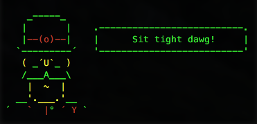

# generator-dawg

> Don't Automate Without Gulp! generator-dawg is an opinionated [Yeoman](http://yeoman.io) generator that gets you up and running with modern front-end web development tools. Inspired by [generator-modern-frontend](https://github.com/endel/generator-modern-frontend).

## Features

* Development
	* Package management with [npm](http://npmjs.com)
	* Building with [Gulp](http://gulpjs.com/)
	* Live-reloading with [BrowserSync](http://www.browsersync.io)
    	* Automatically reload the browser when changes to the file system are detected
    	* Changes in stylesheets inject into the browser without triggering a reload
    * Scaffolds out common files like favicon.ico, robots.txt, Readme.md, and more
* JavaScript
	* ES6 transpiling with [Babel](https://babeljs.io)
		* Full ES6 module support with [Browserify](http://browserify.org)
	* Linting with [JSHint](http://jshint.com/install/)
	* Testing with [Mocha](http://mochajs.org)
	* Documentation generation with [ESDoc](https://esdoc.org/esdoc/)
	* Minification with [uglify](https://www.npmjs.com/package/gulp-uglify)
	* Concatenation with [gulp-concat](https://www.npmjs.com/package/gulp-concat)
* CSS
	* Preprocessing with [Sass](http://sass-lang.com)
	* Autoprefixing with [PostCSS](https://github.com/postcss/postcss) and [Autoprefixer](https://www.npmjs.com/package/autoprefixer)
	* Minification with [cssnano](http://cssnano.co) and [uncss](https://www.npmjs.com/package/gulp-uncss)
	* Concatenation with [gulp-concat](https://www.npmjs.com/package/gulp-concat)
	* Includes [normalize.css](https://github.com/necolas/normalize.css/) for cross-browser normalization
* Images
	* Compression with [imagemin](https://www.npmjs.com/package/imagemin)
	* Spriting with [spritesmith](https://github.com/twolfson/gulp.spritesmith) [Not yet implemented]

*For more information on what this generator can do for you, take a look at the [gulp plugins](app/templates/_package.json) used in our `package.json`.*

## Getting Started

1. Install Yeoman: `npm install --global yo`
2. Install this generator: `npm install --global generator-dawg`
3. Create a directory for your new project: `mkdir my_new_project && cd my_new_project`
3. Run `yo dawg` to install dependencies and start scaffolding. This will run `gulp serve --silent` upon completion, and will fire up your favorite browser at <i>localhost:9000</i>, which points to your shiny new web app. 

Now you're ready to go! Open up `.` in your favorite text editor and begin hacking. 

You can add files to your project as you normally would. Third-party scripts and styles can be placed in `src/scripts/vendor` and `src/styles/vendor`, and Gulp will automatically concatenate and minify them into your app's main scripts/stylesheet. 

Other useful commands (after you've already `yo dawg`ed):

- Run `gulp serve --silent` to preview and watch for changes
- Run `npm install --save <package>` to install frontend dependencies
- Run `gulp` to build for production

## Options

- `--skip-install`
  Skips the automatic execution of `npm` after scaffolding has finished.

## License

[BSD license](http://opensource.org/licenses/bsd-license.php)